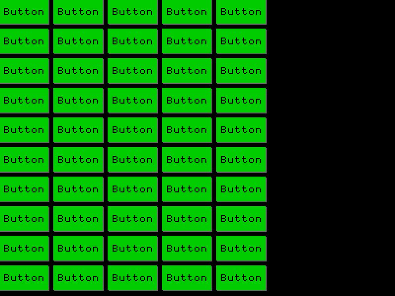

# ImHui

*Immediate Human User Interface*



Inspired by [Dear ImGui](https://github.com/ocornut/imgui). The purpose of this project is to learn more about how Immediate Mode GUIs actually work.

The scope of this project is extremely small. We are not trying to compete with ImGui. We are just trying to learn things and have fun.

**WARNING! The Library is NOT finished!**

## Quick Start

```console
$ make -B
$ ./main
```
